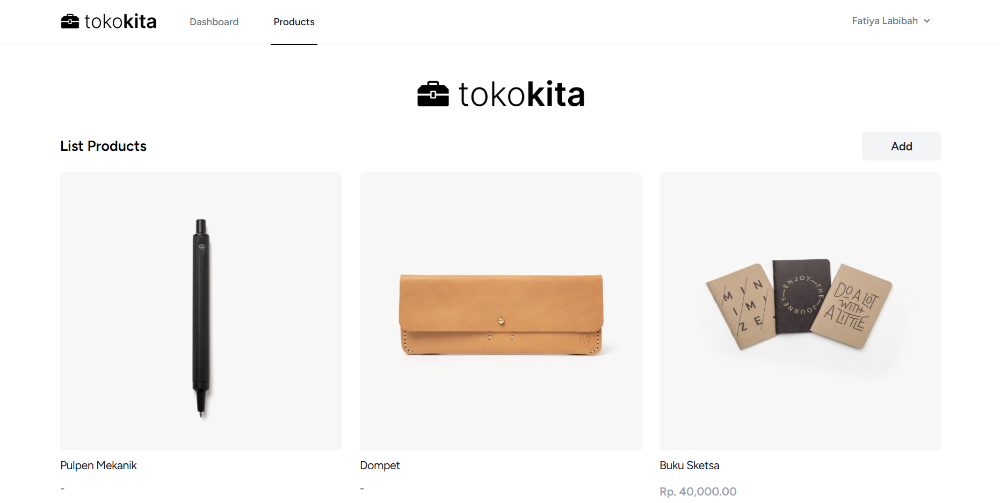

#  TokoKita - Modern Product Management System

> A comprehensive e-commerce and product management dashboard built with Laravel 11. Featuring secure authentication, full CRUD capabilities, and a responsive UI designed with Tailwind CSS.



## ✨ Key Features

### 💻 User Interface (Frontend)

* **Modern Dashboard:** Clean and intuitive layout built with **Blade Templates** and **Tailwind CSS**.
* **Responsive Design:** Fully optimized for Desktop, Tablet, and Mobile devices using Tailwind's utility-first classes.
* **Interactive Forms:** User-friendly forms for adding and editing products with validation feedback.
* **Dynamic Content:** Real-time product listing with pagination and search capabilities.
* **Profile Management:** Users can update their profile information and change passwords securely.

### 🛡️ Administrator & Backend

* **Secure Authentication:** Built-in login, registration, and password reset functionality (Laravel Breeze/Auth).
* **CRUD Operations:** Complete Create, Read, Update, and Delete system for managing product inventories.
* **Image Management:** Handles product image uploads and storage securely using Laravel's Storage system.
* **Data Validation:** Robust server-side validation to ensure data integrity.
* **Database:** Efficient data structuring using **MySQL** with Eloquent ORM.

## ♟️ Tech Stack

| Area | Technologies |
| --- | --- |
| **Framework** | Laravel 11 (PHP) |
| **Frontend** | Blade Templates, Tailwind CSS, Alpine.js, Vite |
| **Database** | MySQL / MariaDB (Eloquent ORM) |
| **Authentication** | Laravel Breeze |
| **Server** | Apache / Nginx |
| **Language** | PHP 8.2+ |

## ⚙️ Installation & Setup (Local)

Follow these steps to run the project locally on your machine.

### Prerequisites

* PHP (v8.2+)
* Composer
* Node.js & NPM
* MySQL Database

### 1. Clone Repository

```bash
git clone https://github.com/fatiya17/tokokita.git
cd tokokita

```

### 2. Install Dependencies

Install PHP dependencies via Composer and Frontend dependencies via NPM.

```bash
# Install PHP packages
composer install

# Install Node modules
npm install

```

### 3. Environment Configuration

Duplicate the `.env.example` file and rename it to `.env`. Configure your database credentials.

```bash
cp .env.example .env

```

Open `.env` and update the database settings:

```env
APP_NAME=TokoKita
APP_URL=http://localhost:8000

DB_CONNECTION=mysql
DB_HOST=127.0.0.1
DB_PORT=3306
DB_DATABASE=tokokita_db
DB_USERNAME=root
DB_PASSWORD=

```

### 4. Application Setup

Generate the application key, run migrations, and link the storage.

```bash
# Generate Key
php artisan key:generate

# Run Database Migrations
php artisan migrate

# Link Storage (for image uploads)
php artisan storage:link

```

### 5. Build & Run

Build the frontend assets and start the local development server.

```bash
# Build assets (in a separate terminal)
npm run build

# Start server
php artisan serve

```

Access the application at: `http://localhost:8000`

---

## 🔗 Application Routes

The application uses standard Laravel web routes. Below are the key routes available.

| Method | URI | Description |
| --- | --- | --- |
| **GET** | `/login` | User Login Page |
| **GET** | `/register` | User Registration Page |
| **GET** | `/dashboard` | Main Dashboard (Authenticated) |
| **GET** | `/products` | List all products |
| **GET** | `/products/create` | Show form to add new product |
| **POST** | `/products` | Store new product data |
| **GET** | `/products/{id}/edit` | Show form to edit product |
| **PUT** | `/products/{id}` | Update product data |
| **DELETE** | `/products/{id}` | Delete a product |
| **PATCH** | `/profile` | Update user profile info |

---

## ☁️ Deployment Guide

This project can be deployed on shared hosting, VPS, or PaaS (like Railway/Heroku/Vercel with PHP runtime).

### Standard Deployment (Shared Hosting/VPS)

1. Upload files to the server.
2. Point the web server (Nginx/Apache) document root to the `public/` folder.
3. Set correct permissions for `storage/` and `bootstrap/cache/` folders:
```bash
chmod -R 775 storage bootstrap/cache

```


4. Run migrations on the production database.
5. Ensure `.env` is configured for production (`APP_ENV=production`, `APP_DEBUG=false`).

---

## 🪶 Credits

Developed by **Fatiya Labibah**.

* **Framework:** [Laravel](https://www.google.com/search?q=https://laravel.com)
* **Styling:** [Tailwind CSS](https://www.google.com/search?q=https://tailwindcss.com)
* **Icons:** [Heroicons](https://www.google.com/search?q=https://heroicons.com) / Bootstrap Icons
* **Resource:** [Playlist Youtube](https://www.youtube.com/playlist?list=PLIan8aHxsPj2O_xTaKO56CdwjEOuZPNE1) 

---

⭐ **Don't forget to star this repo if you find it useful!**

---

*© 2026 TokoKita Project. All Rights Reserved.*